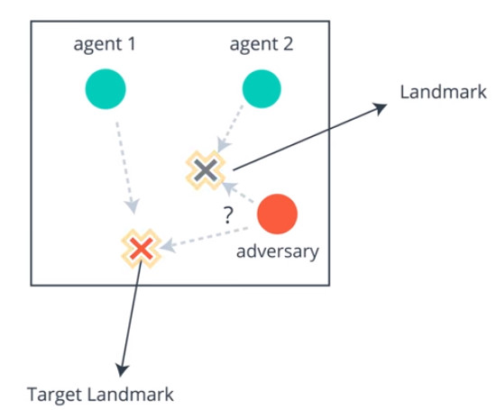

# physical-deception
This repository contains an implementation of Multi-Agent Deep Deterministic Policy Gradient in PyTorch to solve the Physical Deception environment from OpenAI.
This source was copied from [handria-ntoanina GitHub repo](https://github.com/handria-ntoanina/physical-deception)

## Environment
- Train agents to solve the Physical Deception problem.
- **Goal of the environment**
    - 2 Blue dots are the "good agents".
    - 1 Red dot is an "adversary agent". 
    - There are one target landmark, and one fake landmark. 
    - The target of all agents are to be as close as possible to the target landmark.
    - The blue agents know which one is the target, but the Red agent does not know which which one is the target.
    - **The optimal solution** is for the **red agent to chase one of the blue agent**, and for the **blue agents to split up** and go toward each of the target.
    - A positive reward depends on the distance between the blue agents and the target landmark wherease
    - A negative reward is received proportionally to the distance between the red agent and the target landmark.



## Files in the repository
* main.py: run this to train the model. Be sure to increase the number of parallel agents to the number of cores your computer have in main.py
* maddpg.py: implementation of the Multi-Agent Deep Deterministic Policy Gradient
* clean.sh: to delete the logs before the training
* run_tensorboard.sh: to visualize the progress of the training
## Requirements
To run the codes, follow the next steps:
* Create a new environment:
	```bash
	conda create --name maddpg python=3.6
	conda activate ddpg
    ```
	
* Install Tensorflow and Tensorboard
    ```bash
    pip install tensorflow, tensorflow-gpu
    ``` 
    or 
    ```bash
    pip install tensorflow
    ``` 
* Install OpenAI Baseline by following this [instruction](https://github.com/openai/baselines) (use this commit hash: 98257ef8c9bd23a24a330731ae54ed086d9ce4a7).
The following guidance are helpful in a Windows environment:
    * This link may help on how to revert to a specific commit using [TortoiseGit](https://stackoverflow.com/questions/46690334/how-to-revert-a-particular-commit-using-tortoisegit).
    * Some exception related to the compiling of atary-py and mucojo-py may arise, just ignore them. The next instructions are clues that may help to fix them
        * [Make](http://gnuwin32.sourceforge.net/packages/make.htm) needs to be available also on Windows PATH
        * [zlib](http://gnuwin32.sourceforge.net/packages/zlib.htm) is needed to compile atari-py and should be added on Windows PATH
        * The following packages are required to compile mucojo-py
        ```bash
        pip install cffi, cython, lockfile
        ```
* Install [pytorch](http://pytorch.org/)
```bash
conda install pytorch -c pytorch
```
* Install [Tensorboard-Pytorch](https://github.com/lanpa/tensorboard-pytorch)
```bash
pip install tensorboardX
```
* Install [OpenAI Gym](https://github.com/openai/gym)
```bash
pip install gym==0.10.5
```
* Install these other packages
```bash
pip install imageio cloudpickle progressbar
```

## Run the code
1. To run the code, please use the command "./run_training.sh". The bash script cleans up and DELETE previous runs. The script is necessary because we need an extra command to ensure image rendering is possible remotely. Training takes about two hour. If you run locally on your own computer. Be sure to increase the number of parallel agents to the number of cores your computer have in main.py. GPU does not help that much in the computation.

2. To see a visualization of the results, run the script "./run_tensorboard.sh". A link will appear, and direct your browser to that link to see rewards over time and other statistics